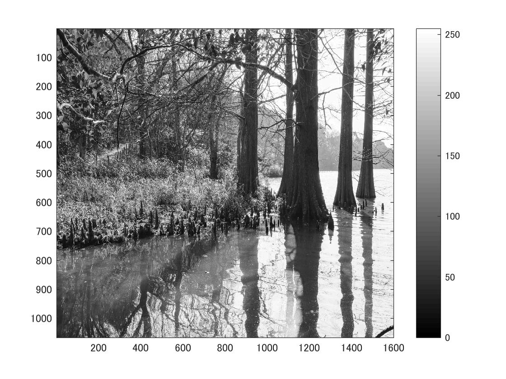

標準画像「篠栗九大の森と蒲田池」を原画像とする．この画像は縦6000画像，横4000画素による正方形のディジタルカラー画像である．

ORG=imread('sample.jpg');  
ORG= rgb2gray(ORG);   
imagesc(ORG); colormap(gray); colorbar;  

によって，原画像を読み込み， カラー画像を白黒濃淡画像へ変換，表示した結果を図１に示す．

図1　原画像を白黒濃淡画像へ変換したもの

次にプレウィット法を用いてエッジ抽出をする．  
MG = edge(ORG,'prewitt');  
imagesc(IMG); colormap('gray'); colorbar;  
その結果を図2で示す．

図2　プレウィット法を用いてエッジ抽出した画像

次にソベル法を用いてエッジ抽出をする．  

MG = edge(ORG,'sobel');  
imagesc(IMG); colormap('gray'); colorbar;  

その結果を図3で示す．

図3　ソベル法を用いてエッジ抽出した画像

最後に，キャニー法を用いてエッジ抽出をする．  

IMG = edge(ORG,'canny');  
imagesc(IMG); colormap('gray'); colorbar;  

その結果を図4で示す．

図4　キャニー法を用いてエッジ抽出した画像
