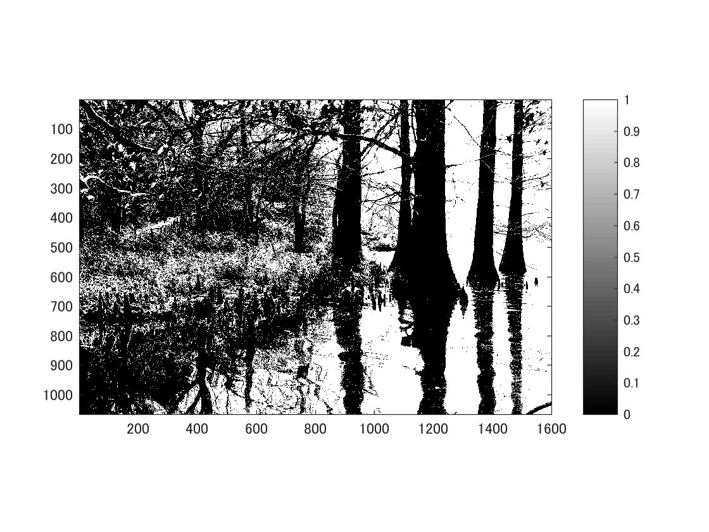
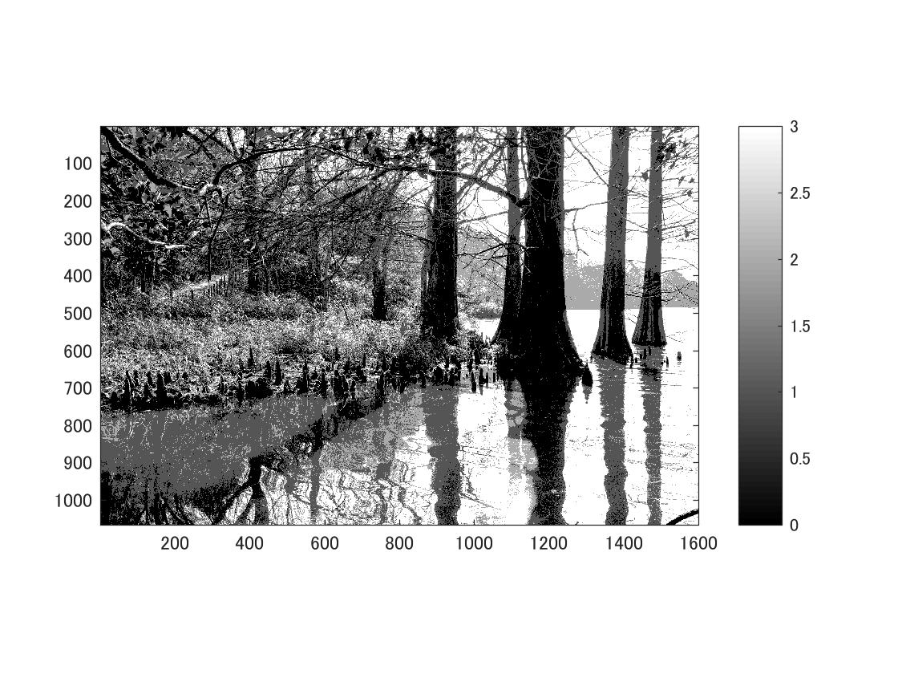
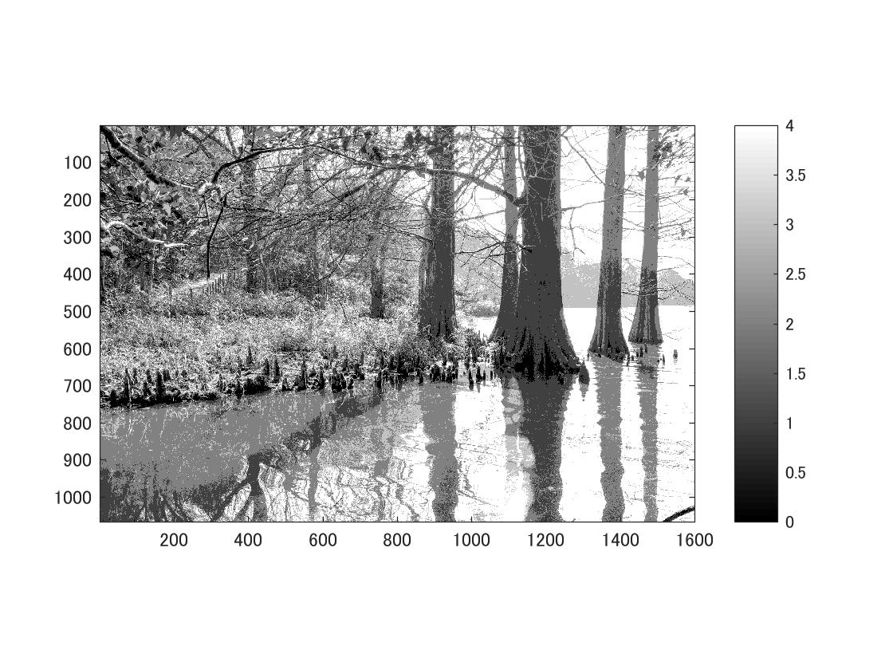

標準画像「篠栗九大の森と蒲田池」を原画像とする．この画像は縦6000画像，横4000画素による正方形のディジタルカラー画像である．

ORG=imread('Sample.jpg'); % 原画像の入力
ORG = rgb2gray(ORG); colormap(gray); colorbar;
imagesc(ORG); axis image; % 画像の表示

によって，原画像を読み込み，白黒にして表示した結果を図１に示す． 

 
図1　原画像を白黒にしたもの

上の画像を２階調画像しするのには、以下のような設定をする．
IMG = ORG>128;  
imagesc(IMG); colormap(gray); colorbar;  axis image;  

２階調画像の生成の結果を図2に示す．

 
図2　２階調画像

４階調画像，８階調画像の生成も同様に行う．

階調画像の結果を図３，４に示す．

 
図3　４階調画像

 
図4　8階調画像
