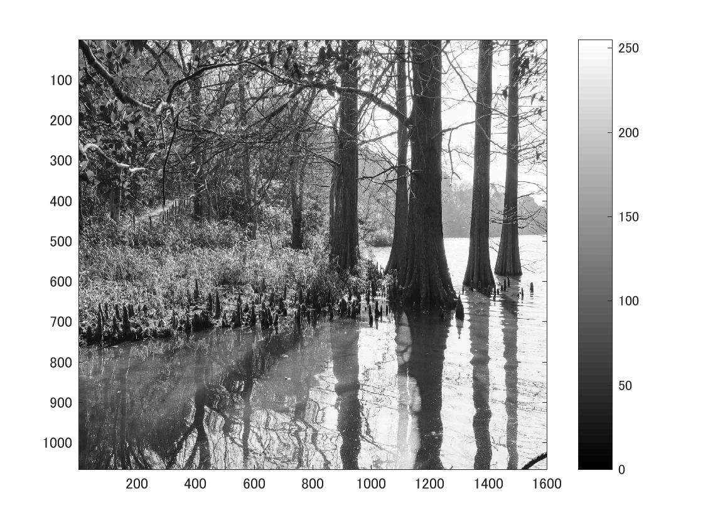

標準画像「篠栗九大の森と蒲田池」を原画像とする．この画像は縦6000画像，横4000画素による正方形のディジタルカラー画像である．

ORG=imread('sample.jpg');  
ORG= rgb2gray(ORG);   
imagesc(ORG); colormap(gray); colorbar;  

によって，原画像を読み込み， カラー画像を白黒濃淡画像へ変換，表示した結果を図１に示す．

図1　原画像を白黒濃淡画像へ変換したもの

閾値を4パターン設定する．今回のパターンは輝度値が64以上の画素を1，その他を0に変換したものと，輝度値が96以上の画素を1，その他を0に変換したもの，
輝度値が128以上の画素を1，その他を0に変換したもの，輝度値が192以上の画素を1，その他を0に変換したものである。
まず，輝度値が64以上の画素を1，その他を0に変換したものを作成する．

IMG = ORG > 64;  
imagesc(IMG); colormap(gray); colorbar;  

この結果作成したものを図2で示す．

図2　原画像を輝度値が64以上の画素を1，その他を0に変換したもの

他も同様に作成する．閾値処理したものを図３～５に示す．

図3　原画像を輝度値が96以上の画素を1，その他を0に変換したもの

図4　原画像を輝度値が128以上の画素を1，その他を0に変換したもの

図5　原画像を輝度値が192以上の画素を1，その他を0に変換したもの
