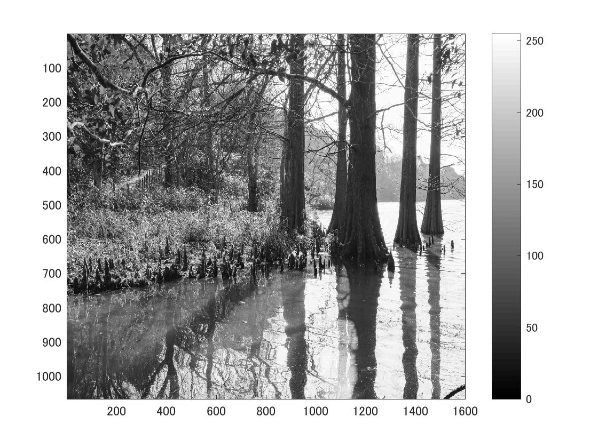
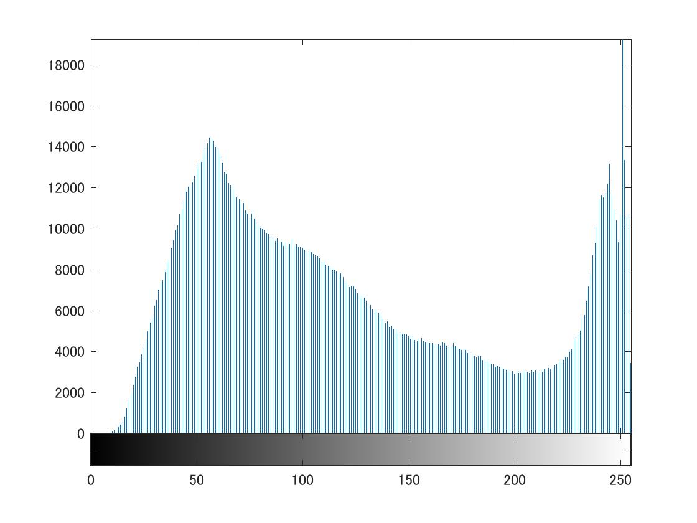

標準画像「篠栗九大の森と蒲田池」を原画像とする．この画像は縦6000画像，横4000画素による正方形のディジタルカラー画像である．

ORG=imread('sample.jpg');  
ORG=rgb2gray(ORG);  
imagesc(ORG); colormap(gray); colorbar;  

によって，原画像を読み込み， カラー画像を白黒濃淡画像へ変換，表示した結果を図１に示す．

図1　原画像を白黒濃淡画像へ変換したもの

ヒストグラムの表示させるには，以下の文が必要である．

imhist(ORG);  
この結果を図２に示す．

図1白黒濃淡画像のヒストグラム表示
