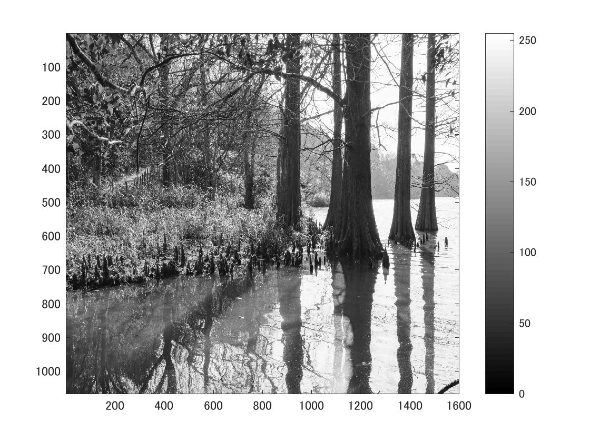
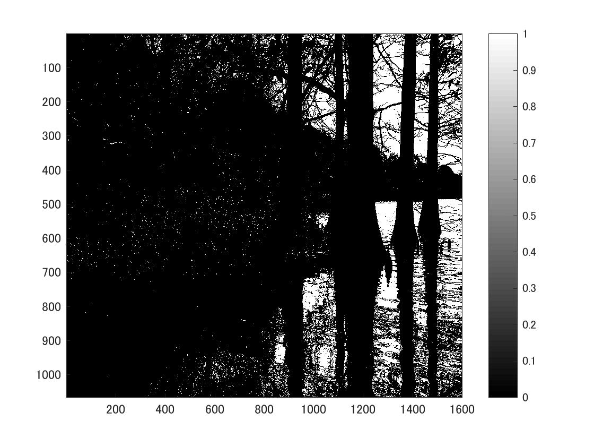

標準画像「篠栗九大の森と蒲田池」を原画像とする．この画像は縦6000画像，横4000画素による正方形のディジタルカラー画像である．

ORG=imread('sample.jpg');  
ORG= rgb2gray(ORG);   
imagesc(ORG); colormap(gray); colorbar;  

によって，原画像を読み込み， カラー画像を白黒濃淡画像へ変換，表示した結果を図１に示す．

図1　原画像を白黒濃淡画像へ変換したもの

次に判別分析法を用いて画像を二値化する．判別分析法とは、対象物の濃度と、背景の濃度とがそれぞれ最もよくまとまり、かつ対象物と背景との違いが際立つようにしきい値を定めるものである．
手順として、クラス内分散とクラス間分散を求め、それらの値を利用してしきい値を算出する．

H = imhist(ORG);  
myu_T = mean(H);  
max_val = 0;  
max_thres = 1;  
for i=1:255  
C1 = H(1:i);  
C2 = H(i+1:256);  
n1 = sum(C1);  
n2 = sum(C2);  
myu1 = mean(C1);  
myu2 = mean(C2);  
sigma1 = var(C1);  
sigma2 = var(C2);  
sigma_w = (n1 *sigma1+n2*sigma2)/(n1+n2);  
sigma_B = (n1 *(myu1-myu_T)^2+n2*(myu2-myu_T)^2)/(n1+n2);  
if max_val<sigma_B/sigma_w  
max_val = sigma_B/sigma_w;  
max_thres =i;  

この結果作成したものを図2で示す

図2　判別分析法により二値化した画像
