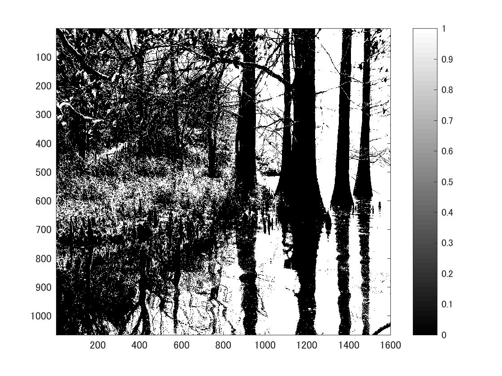
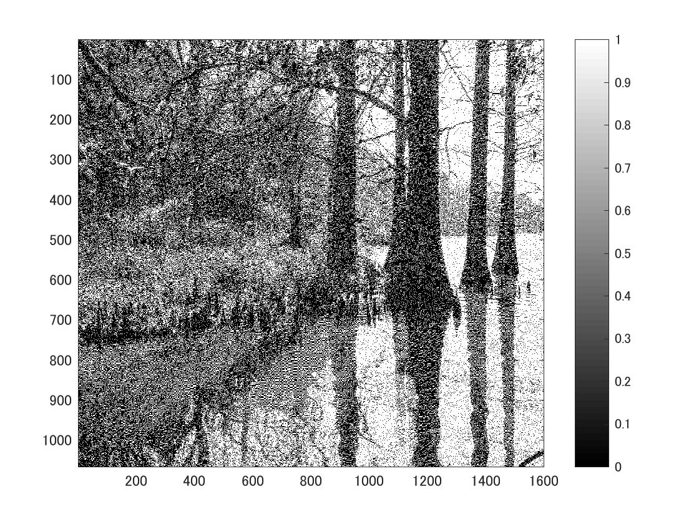

標準画像「篠栗九大の森と蒲田池」を原画像とする．この画像は縦6000画像，横4000画素による正方形のディジタルカラー画像である．

ORG=imread('sample.jpg');  
ORG= rgb2gray(ORG);   
imagesc(ORG); colormap(gray); colorbar;  

によって，原画像を読み込み， カラー画像を白黒濃淡画像へ変換，表示した結果を図１に示す．

図1　原画像を白黒濃淡画像へ変換したもの

次にまず，輝度値が128以上の画素を1，その他を0に変換したものを作成する．

IMG = ORG>128;  
imagesc(IMG); colormap(gray); colorbar;  
この結果を図２に示す．

図2　原画像を輝度値が128以上の画素を1，その他を0に変換したもの

最後に，ディザ法による二値化をする.  
ディザ法とは原画像の各ガぞの黄土値を，画素位置によりあらかじめ定められたディザマトリスクの値と比較して，その大小関係で出力画素の濃度値を決定する方法である．

IMG = dither(ORG);  
imagesc(IMG); colormap(gray); colorbar;  

この結果を図３に示す．

図３　ディザ法による二値化した画像
