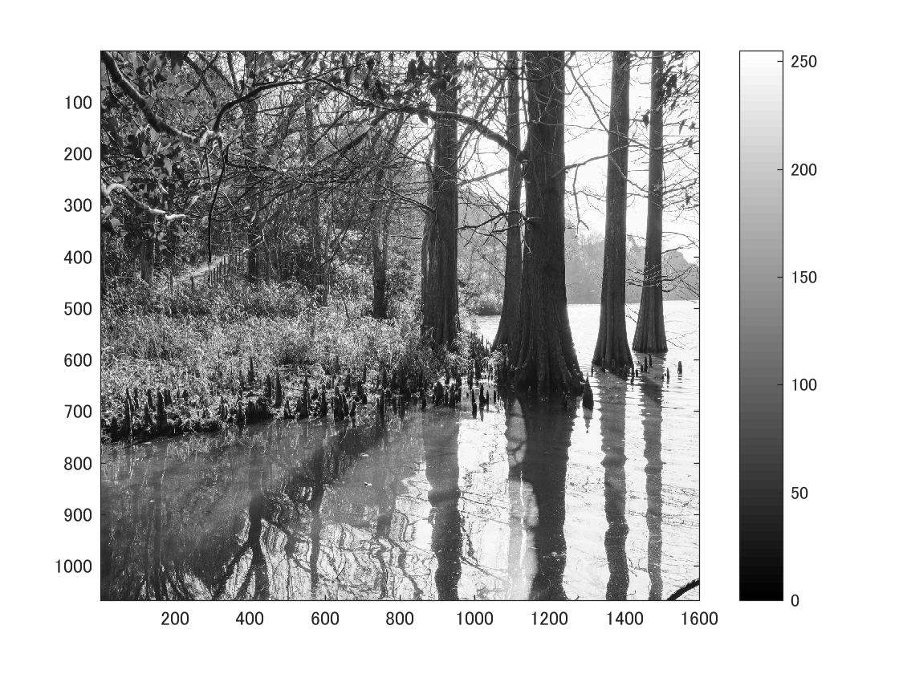
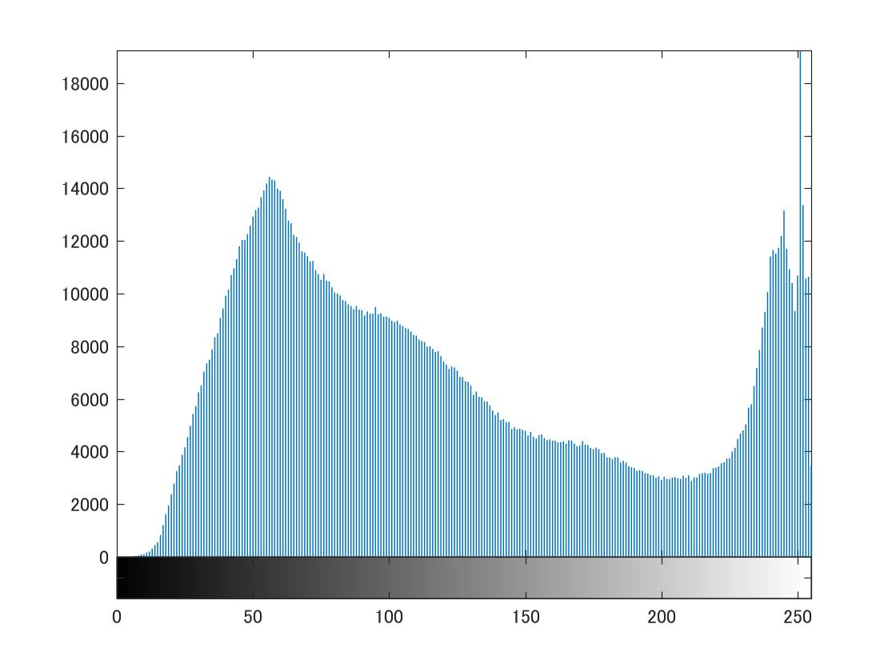
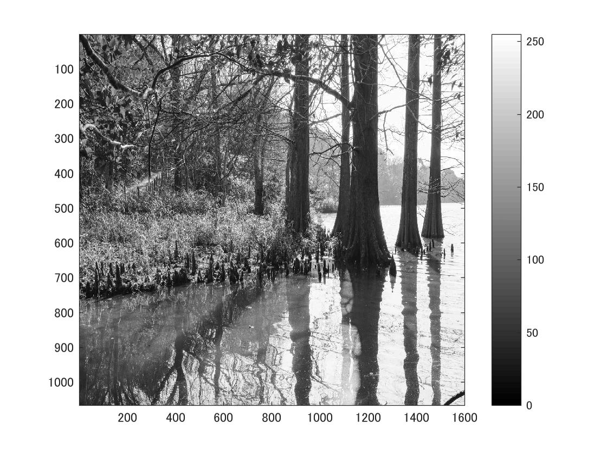

標準画像「篠栗九大の森と蒲田池」を原画像とする．この画像は縦6000画像，横4000画素による正方形のディジタルカラー画像である．

ORG=imread('sample.jpg');  
ORG= rgb2gray(ORG);   
imagesc(ORG); colormap(gray); colorbar;  

によって，原画像を読み込み， カラー画像を白黒濃淡画像へ変換，表示した結果を図１に示す．

図1　原画像を白黒濃淡画像へ変換したもの

また，白黒濃淡画像を濃度ヒストグラムを生成、表示したものが図２である．

imhist(ORG);  

図1　白黒濃淡画像の濃度ヒストグラム

ダイナミックレンジとは画像で使用されている濃度値の幅を指す．プログラム中

mn = min(ORG(:));
mx = max(ORG(:));

を実行することで濃度値の最小および最大値が得られる．

ここでダイナミックレンジを拡大する処理として

ORG = (ORG-mn)/(mx-mn)*255;

を実行する．ORGには原画像が格納されている．ORGに対する演算処理は原画像の持つ全ての画素値に対して行われる．その結果が図3である．

図3　ダイナミックレンジ後の白黒濃淡画像

そして，倍精度値doubleに変換したものを最終的に符号なし整数uint8に変換し、濃度ヒストグラムである図4が示される．

図3　ダイナミックレンジ後の白黒濃淡画像の濃度ヒストグラム
