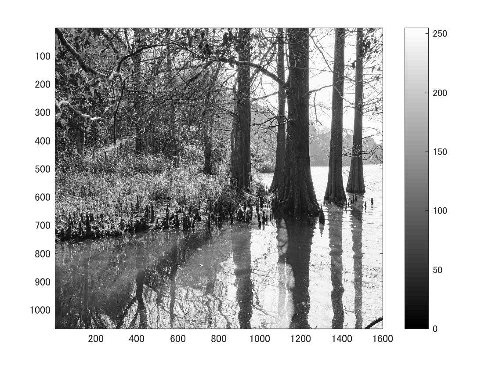
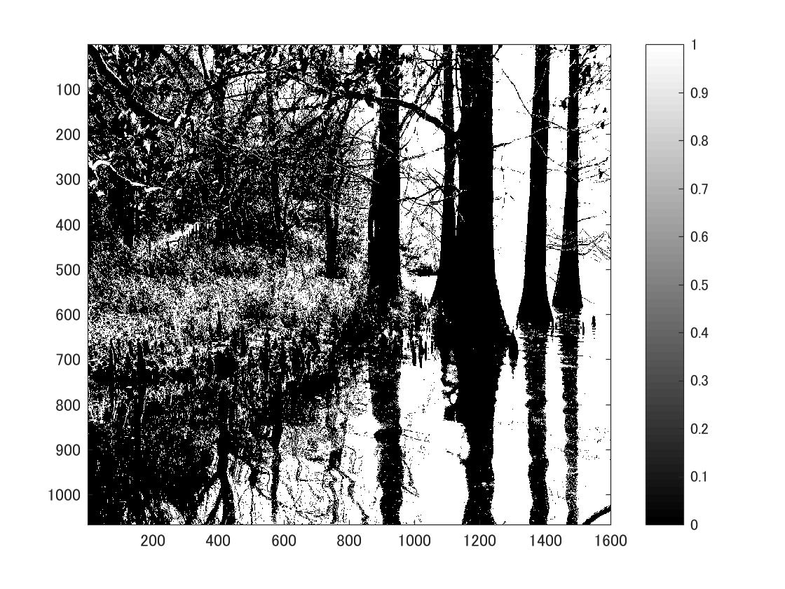
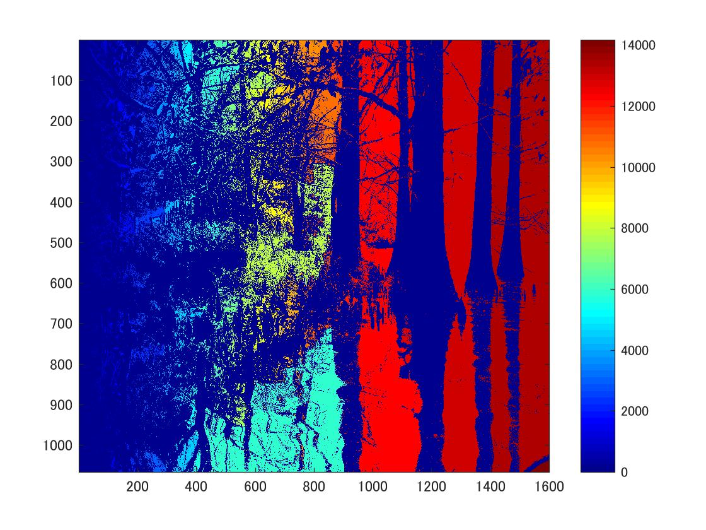

標準画像「篠栗九大の森と蒲田池」を原画像とする．この画像は縦6000画像，横4000画素による正方形のディジタルカラー画像である．

ORG=imread('sample.jpg');  
ORG= rgb2gray(ORG);   
imagesc(ORG); colormap(gray); colorbar;  

によって，原画像を読み込み， カラー画像を白黒濃淡画像へ変換，表示した結果を図１に示す．

図1　原画像を白黒濃淡画像へ変換したもの

次に 閾値128で二値化した画像を表示する．
IMG = ORG > 128;  
imagesc(IMG); colormap(gray); colorbar;  

結果を図2で示す．

図2　閾値128で二値化した画像

同じ連結に属する画素に同一番号を，異なる連結成分に異なる番号を与える処理をラベリングという．手順として、  
➀画像をラスタ走査し，対象物を示すまだラベルが割り当てられていない連結成分の1-画素を見つけ、その画素に新しいラベルを付ける．  
➁その1-画素に連結する1-画素を調べ，それらに同一のラベルを割り当てる．  
➂1つの連結成分のラベリングが終わると，元のラスタ走査の続きに戻り，まだラベルが割り当てられていない新しい連結成分の1-画素を見つける．  
➃前期➀～➂の操作をすべての1-画素がなくなるまで続ける．
その結果を図3で示す．

図3　ラベリングした画像
