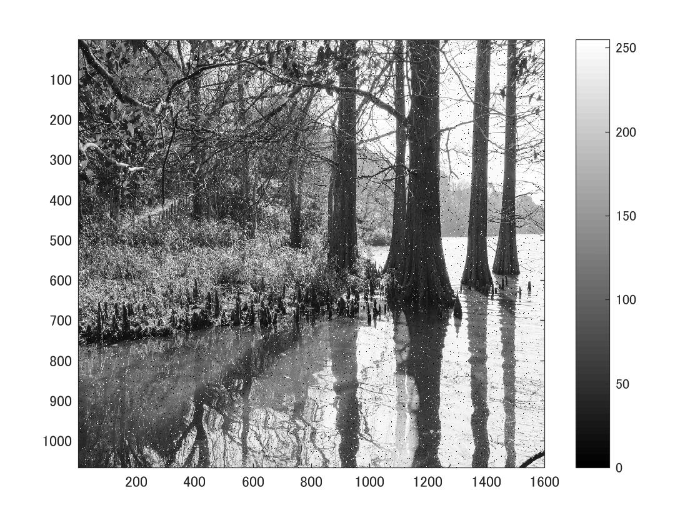
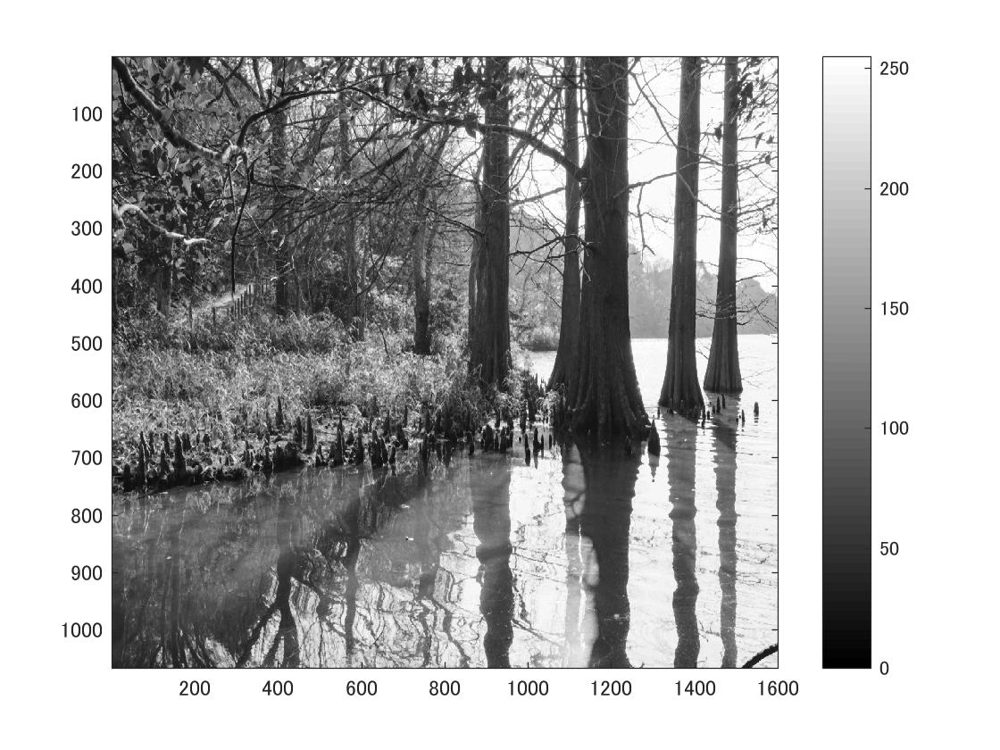
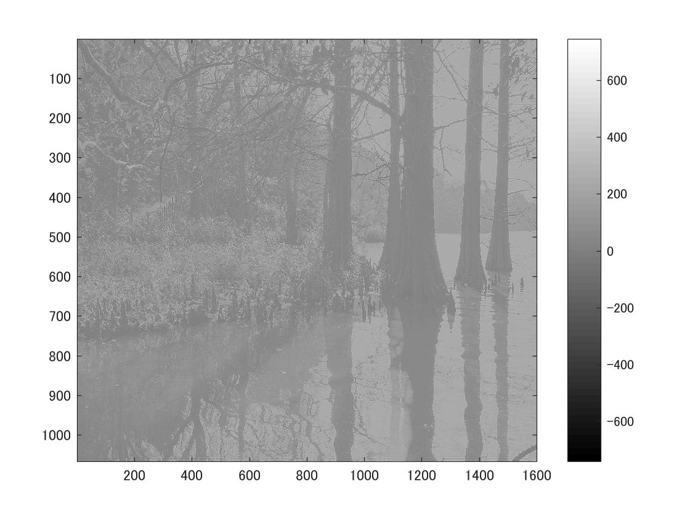

標準画像「篠栗九大の森と蒲田池」を原画像とする．この画像は縦6000画像，横4000画素による正方形のディジタルカラー画像である．

ORG=imread('sample.jpg');  
ORG= rgb2gray(ORG);   
imagesc(ORG); colormap(gray); colorbar;  

によって，原画像を読み込み， カラー画像を白黒濃淡画像へ変換，表示した結果を図１に示す．

図1　原画像を白黒濃淡画像へ変換したもの

次にノイズ添付をした画像を表示させる．  
ORG = imnoise(ORG,'salt & pepper',0.02);   
imagesc(ORG); colormap(gray); colorbar;    
その結果を図2で示す．

図2　ノイズ添付をした画像

次に平滑化フィルタで雑音除去した画像を表示させる．  
IMG = filter2(fspecial('average',3),ORG);   
imagesc(IMG); colormap(gray); colorbar;   
その結果を図3で示す．

図3　平滑化フィルタで雑音除去した画像

また，メディアンフィルタで雑音除去した画像を表示させる．  
IMG = medfilt2(ORG,[3 3]);  
imagesc(IMG); colormap(gray); colorbar;  

その結果を図4で示す．

図4　メディアンフィルタで雑音除去した画像

最後に，フィルタを設計した画像を表示させる．  
MG = filter2(f,IMG,'same');  
imagesc(IMG); colormap(gray); colorbar;  

その結果を図5で示す．

図5　フィルタを設計した画像
