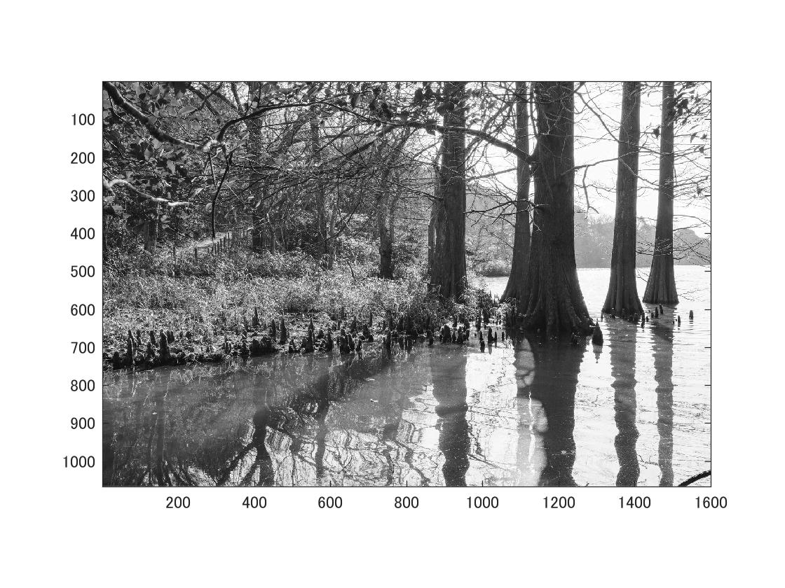

% 課題２　階調数と疑似輪郭
% ２階調，４階調，８階調の画像を生成せよ．
% 下記はサンプルプログラムである．
% 課題作成にあたっては「Lenna」以外の画像を用いよ．

clear; % 変数のオールクリア

ORG=imread('sample.jpg'); % 原画像の入力
ORG = rgb2gray(ORG); colormap(gray); colorbar;
imagesc(ORG); axis image; % 画像の表示
pause; % 一時停止

% ２階調画像の生成
IMG = ORG>128;
imagesc(IMG); colormap(gray); colorbar;  axis image;
pause;

% ４階調画像の生成
IMG0 = ORG>64;
IMG1 = ORG>128;
IMG2 = ORG>192;
IMG = IMG0 + IMG1 + IMG2;
imagesc(IMG); colormap(gray); colorbar;  axis image;
pause;

% ８階調画像の生成
IMG0 = ORG>32;
IMG1 = ORG>64;
IMG2 = ORG>128;
IMG3 = ORG>192;
IMG = IMG0 + IMG1 + IMG2 + IMG3;
imagesc(IMG); colormap(gray); colorbar;  axis image;
pause;

標準画像「篠栗九大の森と蒲田池」を原画像とする．この画像は縦6000画像，横4000画素による正方形のディジタルカラー画像である．

ORG=imread('Lenna.png'); % 原画像の入力
ORG = rgb2gray(ORG); colormap(gray); colorbar;
imagesc(ORG); axis image; % 画像の表示

によって，原画像を読み込み，白黒に画像を編集して表示した結果を図１に示す．

